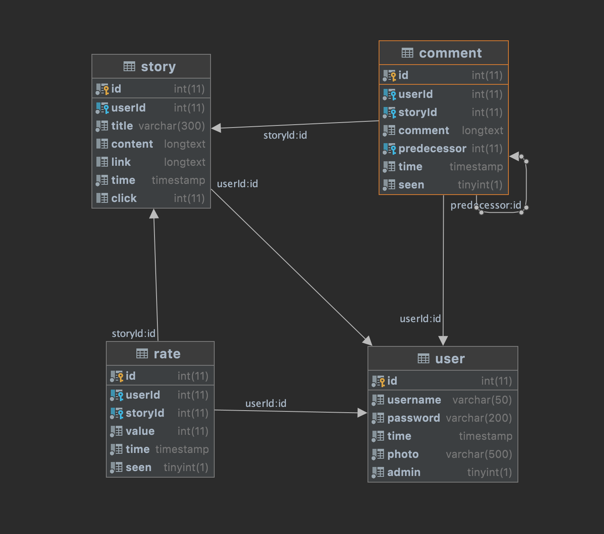

# CSE330

## News Site (60 Points):

#### Pingchuan Huang-503954-KrisCris

#### Path:

- **api/model**: Object models, and functions related to DB operation

- **tools**: some shell script creating folders for storing files used by this web application - user photos, story images, etc. (No time to implement, so..... :/)
- **view/index.php**: main page.
- **view/style**: some css files
- **view/moeule**: components used in index.php, as well as a seperate php file for handling post requests.

#### Some already created account:
- username: root 
- password: root

- username: pingchuan
- password: pingchuan

#### Database

## Grading:

#### User Management (20 Points):

- [x] A session is created when a user logs in (3 points)
- [x] New users can register (3 points)
- [x] Passwords are hashed, salted, and checked securely (3 points)
- [x] Users can log out (3 points)
- [x] A user can edit and delete his/her own stories and comments but cannot edit or delete the stories or comments of another user (8 points)

#### Story and Comment Management (20 Points):

- [x] Relational database is configured with correct data types and foreign keys (4 points)
- [x] Stories can be posted (3 points)
- [x] A link can be associated with each story, and is stored in a separate database field from the story (3 points)
- [x] Comments can be posted in association with a story (4 points)
- [x] Stories can be edited and deleted (3 points)
- [x] Comments can be edited and deleted (3 points)

#### Best Practices (15 Points):

- [x] Code is well formatted and easy to read, with proper commenting (3 points)
- [x] Safe from SQL Injection attacks (2 points)
- [x] Site follows the FIEO philosophy (3 points)
- [x] All pages pass the W3C HTML and CSS validators (2 points)
- [x] CSRF tokens are passed when creating, editing, and deleting comments and stories (5 points)

#### Usability (5 Points):

- [x] Site is intuitive to use and navigate (4 points)
- [x] Site is visually appealing (1 point)

#### Creative Portion (15 Points)

- [x] User can like/dislike a story.
- [x] User can see the number of likes of each story.
- [x] Multi-Page story list: 10 story per page.
- [x] Sub-comment: Comment on other comments.
- [x] User can see the post time of each story.
- [x] User can see the number of visits of each story.
- [x] User can see the number of comments of each story.
- [x] User has a profile photo (Unable to change since I have no time writing its api) 
- [ ] Search.
- [ ] A image with each story.
- [ ] Admin account features.
- [ ] User account settings.
- [ ] Order stories based on number of likes / views.

 Grade: 60/60. 
