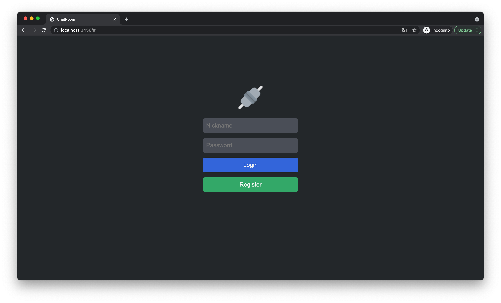
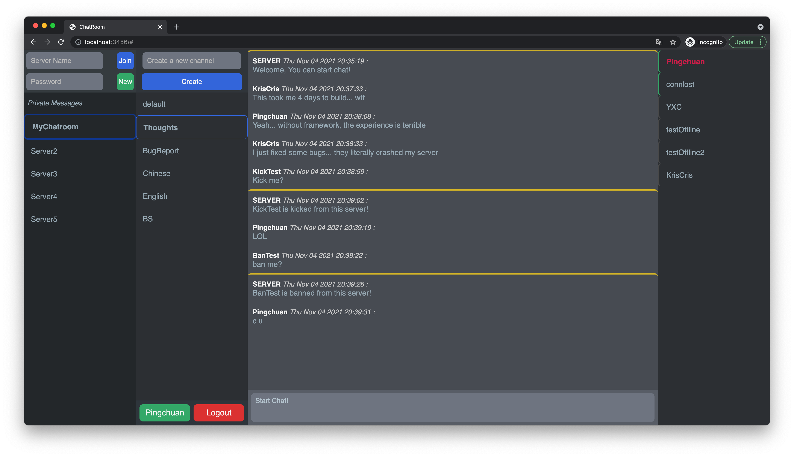
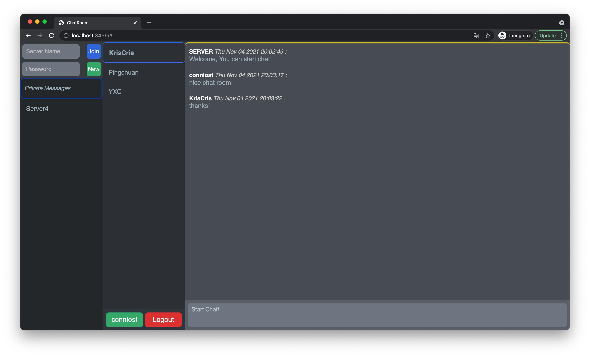
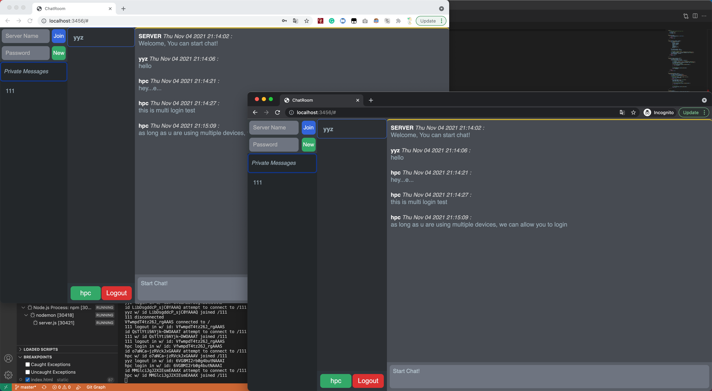

# CSE330

Pingchuan Huang-503954-KrisCris

# Links

[Link using my own domain name](http://ec2.connlost.online:3456/)

[Link using domain name provided by aws](http://ec2-18-117-87-53.us-east-2.compute.amazonaws.com:3456/)

**Note:** Please contact me if you are not able to visit the webpage... The performance of this AWS EC2 is REALLY POOR... Sometimes it got stuck and I had to reboot it manually...

# Screenshots

- Login

- Group Chats

- Private Messages

- Multi-Devices Login

## Grading

- **Administration of user created chat rooms (25 Points):**
  - [x] Users can create chat rooms with an arbitrary room name(5 points)
  - [x] Users can join an arbitrary chat room (5 points)
  - [x] The chat room displays all users currently in the room (5 points)
  - [x] A private room can be created that is password protected (5 points)
  - [x] Creators of chat rooms can temporarily kick others out of the room (3 points)
  - [x] Creators of chat rooms can permanently ban users from joining that particular room (2 points)
- **Messaging (5 Points):**
  - [x] A user's message shows their username and is sent to everyone in the room (1 point)
  - [x] Users can send private messages to another user in the same room (4 points)
- **Best Practices (5 Points):**
  - [x] Code is well formatted and easy to read, with proper commenting (2 points)
  - [x] Code passes HTML validation (2 points)
  - [x] node_modules folder is ignored by version control (1 points)
- **Usability (5 Points):**
  - [x] Communicating with others and joining rooms is easy and intuitive (4 points)
  - [x] Site is visually appealing (1 point)
- **Creative Portion (10 Points)**
  - [x] User can join multiple chat servers
  - [x] Server owner can create multiple channels under their servers (like discord)
  - [x] You don't lose chatroom histories after logout.
    - Note: Data is stored in memory at the moment, if server crashed, data will lose.
  - [x] Chatrooms can show Users' online status (Because you don't lose chatroom histories)
    - left side of username, gray is offline, green is online
  - [x] User typing indicator
  - [x] Messages show sent time
  - [x] Differ server messages (has a gold top border) from users'
  - [x] Support login from multiple devices
    - You can test it using different browsers.
  - [x] You can even send message to someone is offline, they will be able to receive that after login.
  - [ ] @ someone

