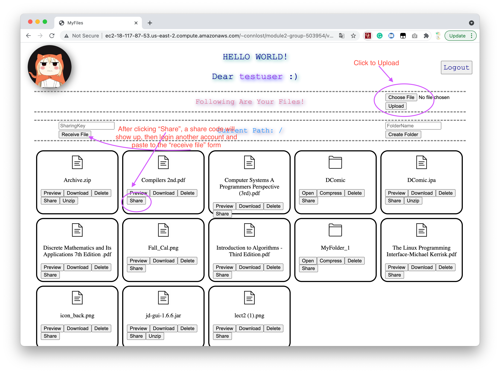

# CSE330

Pingchuan Huang-503954-KrisCris

Xingchen Yang-501890-xingcheny

# link to the site

[Link](http://ec2-18-117-87-53.us-east-2.compute.amazonaws.com/~connlost/module2-group-503954/)

# Note before testing on it
1. we created 2 account, `testuser` and `connlost`, feel free to use them.
2. don't input characters other than number and letters as username, or new folder name.

# Usage

1. login an account
2. click `choose file` to select a file for upload, then click `upload`. The file should show up in your online folder.
3. Click `share` on a file, a sharing code will show up. Copy and paste to the text field on the top-left side, click `receive file`, and a file sharing is done.
4. You can create folders by clicking the top-left side button.
5. You can preview files like images, pdf, mp4, etc. For file cannot be previewed on browser (I suppose you're using chrome), just download it.
6. You can unzip files.
7. You can compress folders that are not empty.
8. There's no double check for deleting any file, be careful.
9. etc.

# Requirements

1. File Sharing Site (40 Points):

   - **File Management (25 Points):**
     - [x] Users should not be able to see any files until they enter a username and log in (4 points)
     - [x] Users can see a list of all files they have uploaded (4 points)
     - [x] Users can open files they have previously uploaded (5 points)
     - [x] Users can upload files (4 points)
     - [x] Users can delete files. If a file is "deleted", it should actually be removed from the filesystem (4 points)
     - [x] The directory structure is hidden. Users should not be able to access or view files by manipulating a URL. (2 points)
     - [x] Users can log out (2 points)
   - **Best Practices (10 Points):**
     - [x] Code is well formatted and easy to read, with proper commenting (4 points)
     - [x] The site follows the FIEO philosophy (3 points)
     - [x] All pages pass the W3C validator (3 points)
   - **Usability (5 Points):**
     - [x] Site is intuitive to use and navigate (4 points)
     - [x] Site is visually appealing (1 point)

2. Creative Portion (15 Points)

   - [x] File will be renamed if file name already exists.
   - [x] Users can zip folders and unzip files
   - [x] Users can create sub-folders
   - [x] Users can nevigate between different level of directories
   - [x] Users can upload files to whichever sub-folders they want.
   - [x] Users can share files/folders among each other via a one-time shareKey.
   - [x] Users can change the shareKey by re-sharing it.
   - [x] You are able to copy and paste files/folders by sharing files to yourself xD.
