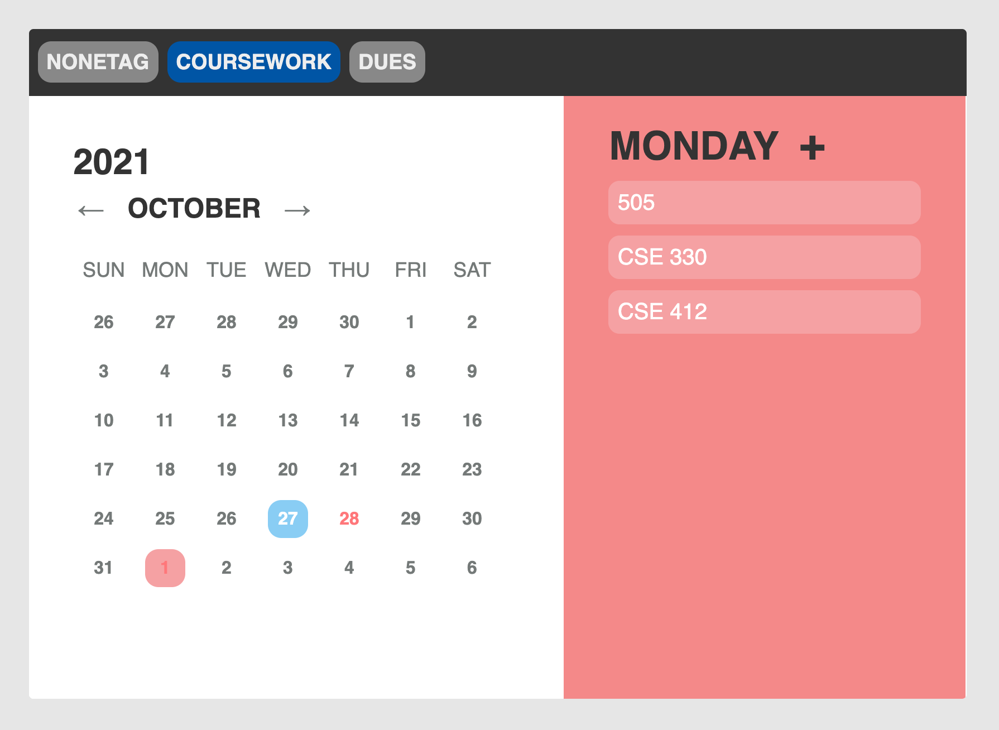
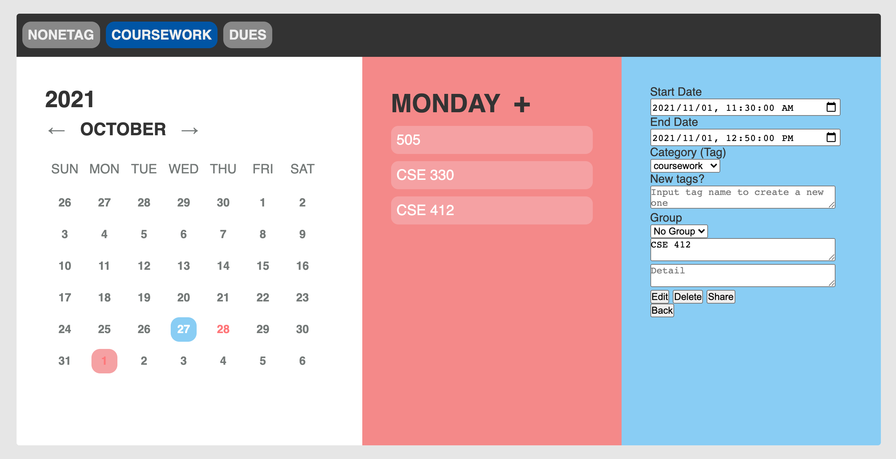

# CSE503S-Module5-Calender

Pingchuan Huang-503954-KrisCris

Xingchen Yang-501890-xingcheny

## About this Project

1. Database

  

2. Link to webpage

    - [Link using my domain name](http://ec2.connlost.online/~connlost/module5-group-503954/view/cal.html)

    - [Link using domain name provided by AWS](http://ec2.connlost.online/~connlost/module5-group-503954/view/cal.html)

3. Created Accounts

    - user1
    - user2
    - groupuser1
    - groupuser2 
  
    **Note:** password is the same as username

4. Screenshots

  
  

## Grading

1. AJAX Calendar (60 Points):

   - **Calendar View (10 Points):**
     - [x] The calendar is displayed as a table grid with days as the columns and weeks as the rows, one month at a time (5 points)
     - [x] The user can view different months as far in the past or future as desired (5 points)
   - **User and Event Management (25 Points):**
     - [x] Events can be added, modified, and deleted (5 points)
     - [x] Events have a title, date, and time (2 points)
     - [x] Users can log into the site, and they cannot view or manipulate events associated with other users (8 points)
     - [x] All actions are performed over AJAX, without ever needing to reload the page (7 points)
     - [x] Refreshing the page does not log a user out (3 points)
   - **Best Practices (20 Points):**
     - [x] Code is well formatted and easy to read, with proper commenting (2 points)
     - [x] If storing passwords, they are stored salted and hashed (2 points)
     - [x] All AJAX requests that either contain sensitive information or modify something on the server are performed via POST, not GET (3 points)
     - [x] Safe from XSS attacks; that is, all content is escaped on output (3 points)
     - [x] Safe from SQL Injection attacks (2 points)
     - [x] CSRF tokens are passed when adding/editing/deleting events (3 points)
     - [x] Session cookie is HTTP-Only (3 points)
     - [x] Page passes the W3C validator (2 points)
   - **Usability (5 Points):**
     - [x] Site is intuitive to use and navigate (4 points)
     - [x] Site is visually appealing (1 point)

2. Creative Portion (15 Points)

   - Additional Calendars Features (worth 15 points):

     - [x] Users can tag an event with a particular category and enable/disable those tags in the calendar view. (5 points)
     - [x] Users can share their calendar with additional users. (5 points)
       - User can click an event, then click `share` button to share that event via a sharing code.
     - [x] Users can create group events that display on multiple users calendars (5 points)
       - User can create group by providing a group name and clicking `Create Group!` button on the left side of the website. A group joining code will be generated and other user can join the group using this code and clicking `Join Group` button.
       - Once a group is created, user can select the group they just created and add events associated with this group, so that other group members can see it.
       - **Note**: Even though everyone in the group can create events, only the event creator can modify that specific group event.

   - [x] **Make sure to save a description of your creative portion, and a link to your server in your README.md file.**

