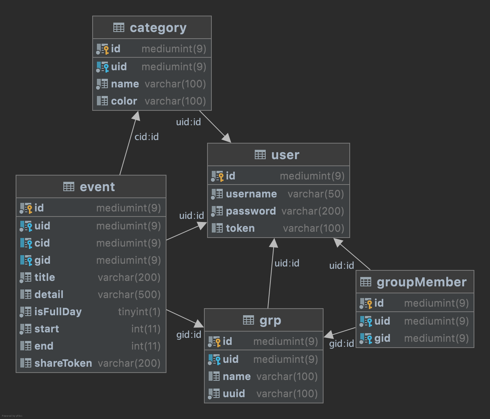

# CSE330
Pingchuan Huang-503954-KrisCris

REPLACE-THIS-TEXT-WITH-YOUR-PARTNERS-NAME-STUDENT-ID-AND-GITHUB-USERNAME

## About this Project

1. Database

## Grading

1. AJAX Calendar (60 Points):

   - **Calendar View (10 Points):**
     - [ ] The calendar is displayed as a table grid with days as the columns and weeks as the rows, one month at a time (5 points)
     - [ ] The user can view different months as far in the past or future as desired (5 points)
   - **User and Event Management (25 Points):**
     - [ ] Events can be added, modified, and deleted (5 points)
     - [ ] Events have a title, date, and time (2 points)
     - [ ] Users can log into the site, and they cannot view or manipulate events associated with other users (8 points)
     - [ ] All actions are performed over AJAX, without ever needing to reload the page (7 points)
     - [ ] Refreshing the page does not log a user out (3 points)
   - **Best Practices (20 Points):**
     - [ ] Code is well formatted and easy to read, with proper commenting (2 points)
     - [ ] If storing passwords, they are stored salted and hashed (2 points)
     - [ ] All AJAX requests that either contain sensitive information or modify something on the server are performed via POST, not GET (3 points)
     - [ ] Safe from XSS attacks; that is, all content is escaped on output (3 points)
     - [ ] Safe from SQL Injection attacks (2 points)
     - [ ] CSRF tokens are passed when adding/editing/deleting events (3 points)
     - [ ] Session cookie is HTTP-Only (3 points)
     - [ ] Page passes the W3C validator (2 points)
   - **Usability (5 Points):**
     - [ ] Site is intuitive to use and navigate (4 points)
     - [ ] Site is visually appealing (1 point)

2. Creative Portion (15 Points)

   - Additional Calendars Features (worth 15 points):

     Develop some additional features for the calendar, a few examples are provided below.

     - [ ] Users can tag an event with a particular category and enable/disable those tags in the calendar view. (5 points)
     - [ ] Users can share their calendar with additional users. (5 points)
     - [ ] Users can create group events that display on multiple users calendars (5 points)

   - **Make sure to save a description of your creative portion, and a link to your server in your README.md file.**